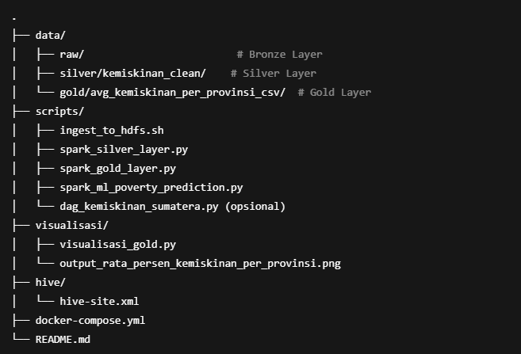

# Project Analisis Big Data - Urban Development -- Pemetaan Daerah Rawan Kemiskinan Berdasarkan Profil Kependudukan Di Sumatera
<<<<<<< 
 # 📦 Big Data Pipeline: Pemetaan Kemiskinan Sumatera

Dokumen ini menjelaskan arsitektur pipeline big data untuk pemetaan tingkat kemiskinan di wilayah Sumatera, menggunakan pendekatan Data Lake dan teknologi Hadoop, Spark, Hive, serta visualisasi dengan Python.

---

## 📁 Struktur Layer Data

### 🔹 Bronze Layer
- **Source:** `Klasifikasi Tingkat Kemiskinan di Indonesia.csv`
- **Tools:** Shell Script (`ingest_to_hdfs.sh`), HDFS
- **Output:** Data mentah disimpan di HDFS `/data/raw/`

---

### 🔸 Silver Layer
- **Deskripsi:** Data dibersihkan dari duplikasi dan missing values, serta distandarisasi.
- **Tools:** Apache Spark (`spark_silver_layer.py`)
- **Output:** `/data/silver/kemiskinan_clean/`

---

### 🟡 Gold Layer
- **Deskripsi:** Data telah diolah dan dilakukan agregasi rata-rata persentase kemiskinan per provinsi.
- **Tools:** Apache Spark (`spark_gold_layer.py`), Hive
- **Output:** `/data/gold/avg_kemiskinan_per_provinsi_csv/`

---

### 🧠 Machine Learning Layer
- **Deskripsi:** Prediksi tingkat kemiskinan berdasarkan fitur sosial ekonomi.
- **Tools:** Apache Spark MLlib (`spark_ml_poverty_prediction.py`)
- **Output:** Prediksi disimpan di HDFS / Hive

---

### 🐘 Hive Table
- **Tabel:** `kemiskinan_aggregated`
- **Query Cek:**
  ```sql
  SELECT * FROM kemiskinan_aggregated LIMIT 10;

## ✅ Status Proyek

| Tahapan                          | Status     |
|----------------------------------|------------|
| Ingest ke HDFS                   | ✅ Selesai |
| Transformasi (Spark Silver)      | ✅ Selesai |
| Agregasi (Spark Gold + Hive)     | ✅ Selesai |
| Prediksi ML (Spark MLlib)        | ✅ Selesai |
| Visualisasi (Python Script)      | ✅ Selesai |
| Airflow (Otomasi)                | ❌ Gagal   |
| Superset (Dashboard)             | ❌ Belum   |


## 📂 Struktur Folder Proyek



=======
>>>>>>> 
